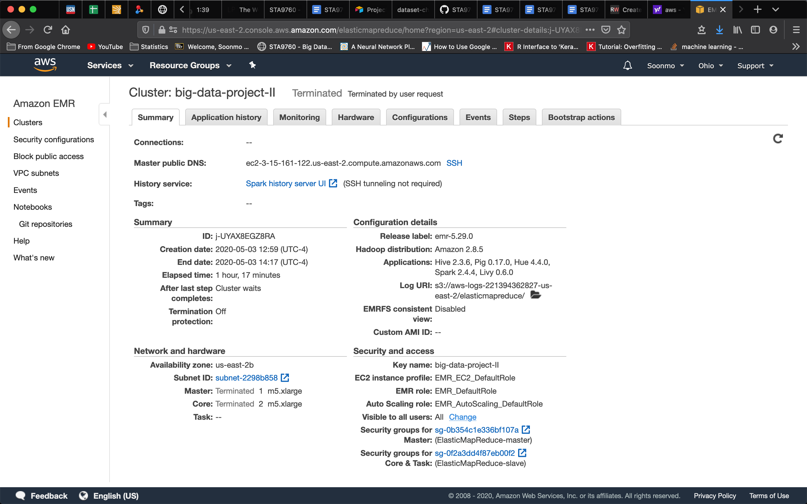
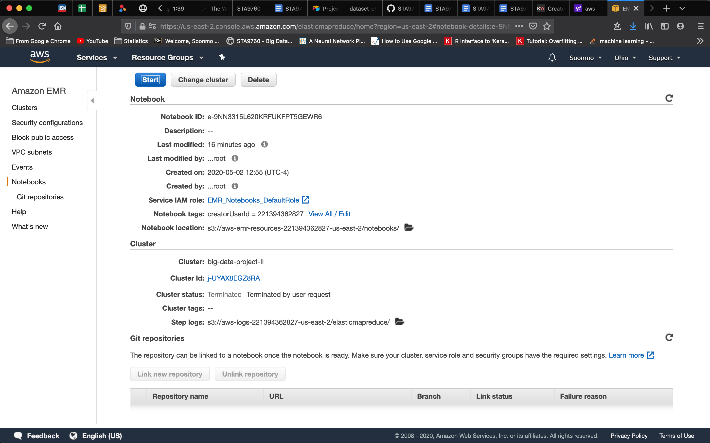

# Analysis on Yelp Business and Customer Patterns

## Description On Basic Concepts

In order to user and business patterns in Yelp, I will analyze three datasets of Yelp at Kaggle: business.json, review.json, and user.json

Those datasets are over one GB, so AWS Big DATA technologies will be implemented such as AWS S3(storage) and EMR(tool to analyze). The datasets is loaded on S3 and Pyspark kernel of Jupyter notebook is used in EMR(python environment). In other words, those datasets are read from S3 and analyzed in Pyspark kernel as below.
```
df = spark.read.json('s3://big-data-project-ii/yelp_academic_dataset_business.json')
```

Regarding the analysis, I will install essential dependencies such as pandas and matplotlib. That is, data wrangling is done by Pyspart, meaningful business patterns extracted by pandas, and important plots drawn by matplotlib.

You can find codes and analysis results at Analysis.ipynb. Ths analysis has mainly four parts.

- Part I: Installation and Initial Setup
- Part II:  Analyzing Categories
- Part III: Do Yelp Reviews Skew Negative?
- Part IV: Should the Elite be Trusted?

## Cluster Configuration



## Notebook Configuration

